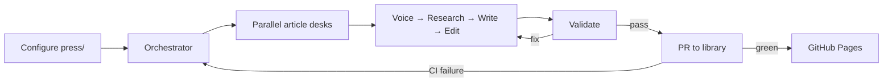

# The Nightly Build


## Your own AI-researched morning paper, published while you sleep

The Nightly Build turns a GitHub repository into a personal newspaper. Describe
what you want to read, connect an agent, and get original, cited articles on
your own GitHub Pages site every morning.

**No backend and no new accounts. It works with your existing AI subscriptions!**

Your paper and its archive live in your fork. You own it.

> [!NOTE]
> Your articles will be searchable from [this website](https://the-nightly-build.github.io/).
> Disable this via setting `directory.publish = false` in your `site.yaml`

## How it works



Each article gets its own desk and worktree. The PR carries the article, assets,
and production record: the commission, voice brief, research log, and edit
notes. [See the full architecture](docs/architecture.md) for the detailed flow.

Sources are collected before writing. Editing is a separate pass. Validation
and CI gate publication. The [FAQ](#faq) explains the boundaries.

`main` holds the engine and your configuration. `library` holds published
articles. Keeping those branches separate makes engine updates and paper
ownership straightforward.

Since you own the code, you can even make personal changes to the engine.
However, note that then it is on you to resolve conflicts or issues when
you sync your fork.

## Get started

### 1. Fork and bootstrap

Fork this repository with **Copy the main branch only** enabled. Keep the fork
public if you want to use GitHub Pages on the free plan.

Clone the fork and run the setup script (or ask your agent to do this in the next step):

```sh
git clone https://github.com/<you>/<your-paper>.git
cd <your-paper>
./setup.sh
```

The script scaffolds `press/`, creates the empty `library` branch, seeds its
workflows, and configures GitHub Pages and auto-merge. It requires `git`,
`gh` (authenticated), Python 3.10+, and PyYAML.

### 2. Configure your paper

Ask your agent to **set me up**, or copy a starting point from [`examples/`](examples/README.md).
Your paper lives in one small configuration tree:

```text
press/
├── site.yaml                 # title and appearance
├── editorial.md              # paper-wide voice
└── series/<id>/
    ├── series.yaml           # cadence and publishing rules
    └── prompt.md             # what this section covers
```

See [Your paper](docs/press.md) and [Series](docs/series.md) for the full
configuration model.

### 3. Rehearse once

Ask your agent for a **press check**. It runs the article workflow locally,
builds a preview, and lets you tune your paper before anything is published.
This is useful for getting a feel for your prompts as well as the HTML components
that come with the repo and/or your own custom ones, which you can read about in
[Customization](docs/customization.md).

### 4. Schedule the night shift

Ask your agent to help you schedule the night shift. You'll need to make sure
it is set up with wider internet access permissions and the ability to raise
a PR in your repository.

The run derives its work from `press/`, so you do not need to update the schedule
when you add or pause a section. The automation only needs to be updated if the
[automation prompt](docs/scheduling.md#the-schedule-prompt) changes.

Choose a provider schedule or the universal GitHub Actions path in
[Scheduling](docs/scheduling.md). [Harnesses](docs/harnesses.md) lists the
supported agents and how their usage is billed.

### 5. Read your paper

The night shift opens pull requests against `library`. Once the first article
merges, GitHub Pages publishes the newsstand, archive, search index, and feeds.
See [Delivery](docs/delivery.md) for the URLs and feed formats.

## Make it yours

- Change the title and appearance in `press/site.yaml`.
- Set the paper-wide voice in `press/editorial.md`.
- Add sections, beats, cadence, and source requirements under `press/series/`.
- Customize themes, furniture, and templates in `press/`.

The [examples](examples/README.md) are a living reference. [Customization](docs/customization.md)
covers the extension points without requiring engine changes.

For contributors and engine maintainers, start with [PROTOCOL.md](PROTOCOL.md) and
[Updating the engine](docs/press.md#updating-the-engine).

## FAQ

<!-- Native disclosure controls keep the FAQ compact. -->
<!-- markdownlint-disable MD033 -->

<details>
<summary>Why are the articles not just one model's first draft?</summary>

Each article gets separate voice, research, writing, and editing passes. The
editor can send a weak claim back for research or ask the writer to try again.

</details>

<details>
<summary>How are claims and citations checked?</summary>

Research records the claim and its source before the writer drafts. Validation
checks citation structure and source policy. It cannot prove that every claim
is true, so doubtful claims should be revised or removed.

</details>

<details>
<summary>What access does the night shift need?</summary>

It needs web access, both branches, and permission to open a pull request to
`library`. PR checks run read-only and do not receive the scheduler's secrets.
See [Scheduling](docs/scheduling.md).

</details>

<details>
<summary>Can it use private or authenticated sources?</summary>

Only if the agent you choose can access them. Do not commit credentials or put
them in article content. Readers should still be able to audit important
sources.

</details>

<details>
<summary>Why does every article use a pull request?</summary>

The PR is the review record and the publishing gate. It contains the article,
its production artifacts, and its validation status.

</details>

<details>
<summary>What does it cost?</summary>

There is no Nightly Build backend fee. Your agent's plan, the number of sections,
and the depth of research determine usage. See [Harnesses](docs/harnesses.md).

</details>

<details>
<summary>Can I keep my paper private?</summary>

Yes, when your GitHub plan supports private Pages. Public repositories are the
simplest option for a free GitHub Pages setup.

</details>

<!-- markdownlint-enable MD033 -->
