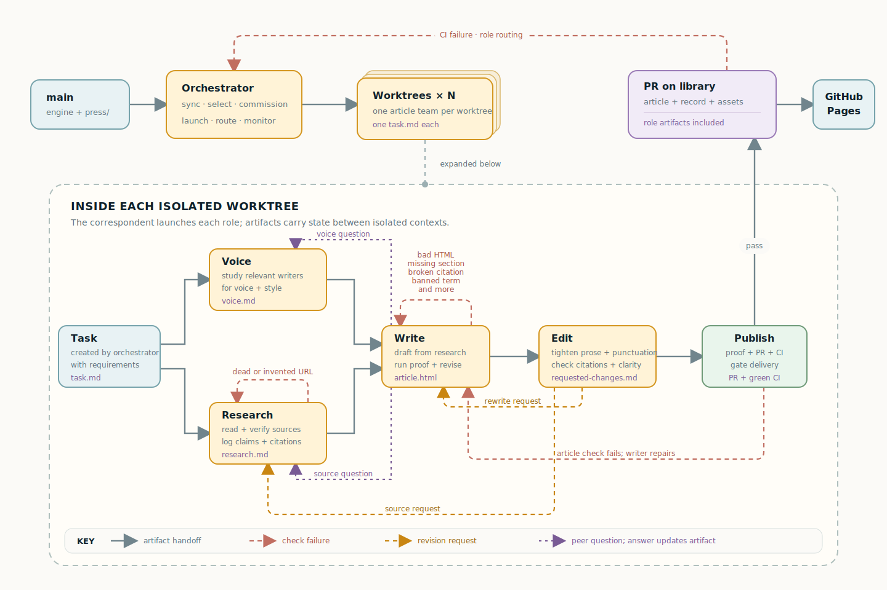

# Architecture

The Nightly Build has two levels:

- The **orchestrator** decides what is due and follows the pull requests.
- A **desk** owns one article, from commission to a green PR.

The same desk runs in parallel for every section due that night.

## One article

The desk keeps the roles separate:

1. The commission defines the article's subject and constraints.
2. The voice coach studies the paper's voice and writes `voice.md`.
3. The researcher builds a claims-and-evidence log in `research.md`.
4. The writer drafts the article from that log.
5. The editor reads it fresh, checks the evidence, and leaves `requested-changes.md`.

The editor can send a weak claim back to research or a prose problem back to
the writer. The desk then assembles the article, any earned assets, and the
production record into one pull request. The record includes the commission,
voice brief, research log, and edit notes.

## Validation and publishing

Validation runs before the pull request opens. It checks the article's
structure, sources, citations, and safety. A failure returns to the desk for a
fix.

The pull request runs CI in a read-only environment. If CI fails, the
orchestrator routes the failure back to the desk. A clean pull request can merge
into `library`, which GitHub Pages turns into the paper, archive, search index,
and feeds.

The full article contract lives in [PROTOCOL.md](../PROTOCOL.md). Scheduling
and its security boundary are covered in [Scheduling](scheduling.md).
