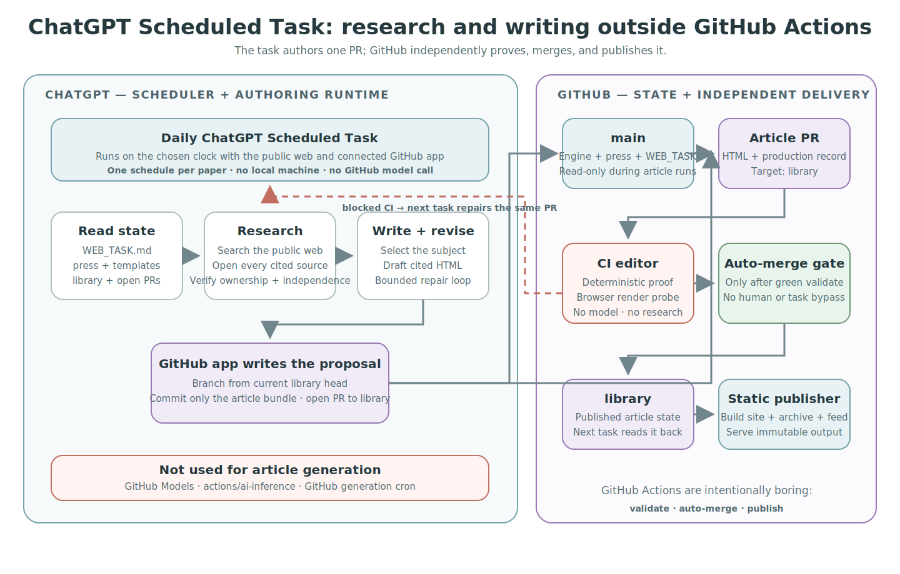

# Scheduling the night shift

The night shift is an agent that runs on a clock. Any hosted agent that can
browse the web and open a pull request can run it. Most runtimes use a checkout;
ChatGPT Scheduled Tasks can instead operate through the public web and a
connected GitHub app.

Two choices are involved, and they are independent:

1. **The setup agent** is whatever you are talking to right now. It configures
   `press/`, bootstraps the publishing branches, and creates the schedule when
   its product exposes that control.
2. **The night-shift runtime and scheduler** is what actually fires nightly. It
   may be the same product or a different hosted agent.

Provider-hosted schedules are the shortest path and may consume a plan you
already pay for. The universal fallback runs a headless agent on a GitHub
Actions cron. [Harnesses](harnesses.md) lists current entrypoints and billing.

## What the night shift needs

Every route needs:

1. A scheduler that fires nightly.
2. Access to the fork's `main` configuration and published `library` state.
3. Public-web access for research.
4. Permission to create work branches and open pull requests targeting
   `library`.

Checkout-based runtimes also need `uv`, Python 3.10+, and access to both refs.
They run `scripts/sync.sh` and the engine locally. Connector-only runtimes do
not pretend to execute those commands; `WEB_TASK.md` defines their conservative
adapter and protected GitHub CI supplies the machine proof.

## ChatGPT Scheduled Tasks

This route keeps all generative work inside the ChatGPT task. GitHub is durable
state and an independent delivery system, not a second model runtime.



### What runs where

**The ChatGPT Scheduled Task performs:**

- cadence and prior-article inspection;
- subject selection;
- public-web research and source verification;
- drafting, citations, HTML assembly, and bounded revision;
- branch creation, commits, article-PR creation, and failed-PR repair through
  the connected GitHub app.

**GitHub Actions performs only:**

- the deterministic article proof and browser render probe;
- labeling and auto-merge after a green required check;
- static site, archive, search, and feed publication.

Do not use GitHub Models, `actions/ai-inference`, or a GitHub generation cron in
this architecture. Those would create a second scheduler and a second model
control loop for the same paper.

### Setup

1. Bootstrap and configure the fork normally. The `library` branch, protected
   article check, auto-merge, and publisher must already work.
2. Connect the fork to ChatGPT's GitHub app. Grant the narrow persistent actions
   needed to read repository state, create branches and commits, and open or
   update pull requests.
3. Prove the exact write surface before scheduling: create a disposable branch,
   commit a harmless file, open a draft PR, then close the PR and remove or reset
   the branch. A setup agent must not infer write access from read access.
4. Keep `WEB_TASK.md` on `main`. It is the complete connector-only execution
   contract and deliberately sends executable proof back to GitHub CI.
5. Create one daily Scheduled Task for the entire paper with the prompt below.
   Do not also create a GitHub generation schedule.
6. Run the task once immediately and verify the resulting article PR, required
   check, merge, publisher run, and final URL.

### Scheduled Task prompt

Replace `<repo>` with the fork's `owner/name` value. This is the complete task
instruction:

> Run the Daily Nightly Build for `<repo>`. Perform all subject selection,
> public-web research, source verification, article drafting, bounded revision,
> and pull-request preparation yourself using the connected GitHub app and the
> public web. Read `WEB_TASK.md` from `main` and follow it exactly. Do not
> dispatch, invoke, or rely on GitHub Models, `actions/ai-inference`, or any
> GitHub-hosted article-generation workflow. GitHub Actions are only the
> independent CI validator, auto-merge gate, and static publisher. If no article
> is due or the evidence is insufficient, publish nothing.

One task runs the whole paper. Adding, pausing, completing, or changing a series
updates repository state rather than the task. The task reconstructs every run
from GitHub and repairs an existing article PR before commissioning another for
the same series.

### Migrating from a GitHub-model prototype

If a fork previously used a repository-native model prototype, remove its model
and generation surface after the ChatGPT task is active:

- scheduled or push-triggered article-generation workflows;
- `actions/ai-inference` steps and `models: read` permissions;
- GitHub Models prompt files;
- generation-only selection, research-pack, drafting, or revision entrypoints.

Keep the trusted article check, auto-merge path, status reporting, and static
publisher. Removing generation does not mean removing CI.

### Security boundary

The task reads arbitrary web pages, so treat its proposed article as untrusted.
It may write only an article branch and PR. The required check runs without task
credentials and rejects unsafe HTML, malformed metadata, weak source structure,
and invalid bundles before auto-merge. Protect `main` and `library`; never give
the task a reason to modify engine, workflow, press, template, or site-asset
files during an article run.

## The universal path: GitHub Actions

This separate route runs a checkout-based headless agent on GitHub's runners
with your machine off. It is useful when the agent has a CLI or Action but no
native hosted scheduler. Copy this into the fork as
`.github/workflows/nightly.yml` and fill in the one marked step:

```yaml
name: nightly-build
on:
  schedule:
    - cron: "0 6 * * *" # 06:00 UTC nightly; pick your hour
  workflow_dispatch: {} # run tonight's first article on demand
permissions:
  contents: write # push the work branch
  pull-requests: write # open the PR to library
jobs:
  night-shift:
    runs-on: ubuntu-latest
    env:
      GH_TOKEN: ${{ github.token }}
    steps:
      - uses: actions/checkout@v4 # main: engine + press/
      - uses: actions/checkout@v4 # library; the agent refreshes it after sync
        with:
          ref: library
          path: library-checkout
      - uses: astral-sh/setup-uv@v5
        with:
          python-version: "3.12"
      # Invoke your checkout-based agent here. It needs web access, its API key
      # as a repository secret, and the two permissions declared above.
      # Per-agent one-liners are in docs/harnesses.md.
```

The trigger lives on `main` or in a separate repository. Never put it on the
untrusted `library` PR path. A scheduled workflow holding an API key is the
trusted side of the line; the article PR check is the untrusted side.

### Security for checkout-based schedules

- Article PRs are checked without scheduler secrets. The proof rejects active
  content, including extra scripts, iframes, forms, and meta-refresh.
- The scheduled agent can push branches. Protect `main` and `library`, require
  `validate`, enforce it for administrators, and disallow force pushes and
  deletion.
- Run under the narrowest identity the provider supports. Changes to
  `press/site.yaml`, workflows, templates, or engine code belong in separately
  reviewed PRs, never article PRs.

### Checkout-based schedule prompt

Paste this wherever a checkout-based scheduler takes a prompt, with `<repo>` and
`<checkout>` filled in:

> You are the night shift for The Nightly Build repo `<repo>`. Check out `main`
> and read `PROTOCOL.md`: it is the complete contract, and the correspondent
> skill carries the procedure. Check out the `library` branch beside it at
> `<checkout>`. The engine scripts need uv and Python 3.10+; run them through
> `uv run`. Research needs web access. This paragraph is the entire assignment.
> If your schedule prompt says more than this, it predates the engine you are
> running: flag that in your PR bodies and ask the owner to paste the current
> paragraph from `docs/scheduling.md`.

One schedule runs the whole paper. To deliberately run series on different
models or schedules, create a second checkout-based schedule and append:
`Work ONLY series <series-id>.`

## Which agent, and the cost

For verified hosted schedulers, headless entrypoints, subscription inclusion,
and metered API paths, see [Harnesses](harnesses.md). The ChatGPT route consumes
ChatGPT task and model allowance and does not use GitHub Models. The universal
Actions route consumes the selected agent or model provider plus GitHub runner
usage where applicable.
